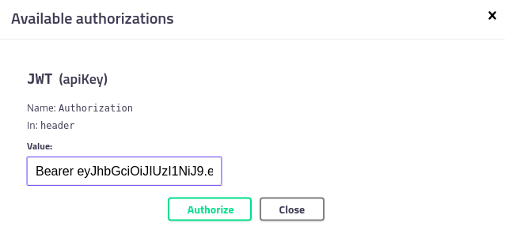

<a href="https://career.softserveinc.com/en-us/technology/course/start_your_career_as_java_developer/"></a>

# GreenCityUBS   [](https://github.com/ita-social-projects/GreenCityUser/blob/dev/LICENSE)  [](https://github.com/ita-social-projects/GreenCity/issues) [](https://github.com/ita-social-projects/GreenCityUser/pulls)


## 1. About the project

The main aim of “GreenCity” project is to teach people in a playful and challenging way to have an eco-friendly lifestyle. A user can view on the map places that have some eco-initiatives or suggest discounts for being environmentally aware (for instance, coffee shops that give a discount if a customer comes with their own cup). А user can start doing an environment-friendly habit and track their progress with a habit tracker. "GreenCityUBS" is a microservice which contains garbage collection service.

## 2. Where to find front-end part of the project

Here is the front-end part of our project: https://github.com/ita-social-projects/GreenCityClient.

`dev` branch of the back-end corresponds to `dev` branch on the front-end. The same thing with `master` branches.

## 3. How to contribute

You're encouraged to contribute to our project if you've found any issues or missing functionality that you would want to see. Here you can see [the list of issues](https://github.com/ita-social-projects/GreenCity/issues) and here you can create [a new issue](https://github.com/ita-social-projects/GreenCity/issues/new).

Before sending any pull request, please discuss requirements/changes to be implemented using an existing issue or by creating a new one. All pull requests should be done into `dev` branch.

Though there are four GitHub projects ([GreenCity](https://github.com/ita-social-projects/GreenCity), [GreenCityUser](https://github.com/ita-social-projects/GreenCityUser) and [GreenCityUBS](https://github.com/ita-social-projects/GreenCityUBS) for back-end part and [GreenCityClient](https://github.com/ita-social-projects/GreenCityClient) for front-end part) all of the issues are listed in the first one - [GreenCity](https://github.com/ita-social-projects/GreenCity).

**NOTE: make sure that your code passes checkstyle. Otherwise your pull request will be declined**. See paragraph [Setup Checkstyle](#5-setup-checkstyle).

## 4. Start the project locally

### 4.1. Required to install

* Java 11
* PostgreSQL 9.5 or higher

### 4.2. How to run

1. You should open in IntelliJ IDEA File -> `New Project` -> `Project From Version Control`
   -> `Repository URL` -> `URL` (https://github.com/ita-social-projects/GreenCityUBS.git) -> `Clone`.


2. Open `Terminal` write `git checkout -b dev` (this create new local branch "dev").


3. After this `git pull origin dev` (for update last version from branch dev)


4. Create new database in Postgres (`greencityubs`).


5. `Add Configuration` -> `+` -> `Application`.


* `Name` : `UbsApplication`.

* `Use classpath of modules`:`core`
* `JRE` : `11`.


6. `Enviroment variables`:


7. `Run`


8. If you did everything correctly, you should be able to access swagger by this URL: http://localhost:8050/swagger-ui.html#/

Also all these variables you can set in Intellij Idea. For instance:

```properties
spring.datasource.url=${DATASOURCE_URL}
spring.datasource.username=${DATASOURCE_USER}
spring.datasource.password=${DATASOURCE_PASSWORD}
spring.mail.username=${EMAIL_ADDRESS}
spring.mail.password=${EMAIL_PASSWORD}
cloud.name=${CLOUD_NAME}
api.key=${API_KEY}
api.secret=${API_SECRET}
google.clientId=${GOOGLE_CLIENT_ID}
spring.rabbitmq.host=${RABBITMQ_HOST}
spring.rabbitmq.password=${RABBITMQ_PASSWORD}
spring.rabbitmq.username=${RABBITMQ_USERNAME}
bucketName=${BUCKET_NAME}
staticUrl=${STATIC_URL}
spring.social.facebook.app-id=${FACEBOOK_APP_ID}
spring.social.facebook.app-secret=${FACEBOOK_APP_SECRET}
greencity.server.address = ${GREENCITY_SERVER_ADDRESS}
```


### 4.3. How to work with swagger UI in our project

1. Run GreenCityUBS project (look up paragraph [How to run](#42-how-to-run)).

2. Run GreenCityUser project (look up paragraph [How to run](https://github.com/ita-social-projects/GreenCityUser#42-how-to-run)).

2. Use the following link to open Swagger UI: http://localhost:8060/swagger-ui.html#/

3. Use POST method with `/ownSecurity/signUp` to create an account.
   If you set a valid email credentials, you should receive an email with verification link. Verify the registration by following that link. We highly recommend to use gmail, it's free of charge and easy to get going: [how to allow email sending from gmail](https://support.google.com/accounts/answer/6010255?authuser=2&p=less-secure-apps&hl=en&authuser=2&visit_id=637098532320915318-4087823934&rd=1),  [Google client id](https://developers.google.com/adwords/api/docs/guides/authentication).
   Alternatively you can drop a record in `verify_email` table on your local database. First you should update user role : `UPDATE users SET role = 1 WHERE id = your_user_id;`. After this `DELETE FROM verify_emails WHERE user_id = your_user_id;`

4. Use POST method with `/ownSecurity/signIn` to sign in. After entering the credentials you should receive access and refresh tokens.

5. Copy the given access token and put it into GreenCityUBS(http://localhost:8050/swagger-ui.html#/) Authentication Header. Press **Authorize** button.

   

   Insert the given token into input field. The scheme should be like this `Bearer <given_token>`. Press **Authorize** button.

   

6. Now you can use swagger UI to test REST API. Some controllers require *ADMIN* role. By default, new registered users have role *USER*. To overcome this you need to update record that corresponds to your user in the local database. For example, `UPDATE users SET role = 1 WHERE id = <your_user_id>`.

### 4.4. Connect with front-end

There is no special configurations required. Just clone [GreenCityClient](https://github.com/ita-social-projects/GreenCityClient) and run it. If you want to sign in with Google account, it's mandatory to set `google.clientId`. Read more about how to obtain [Google client id](https://developers.google.com/adwords/api/docs/guides/authentication), it's free.

## 5. Setup Checkstyle

Here you can read more about [how to set up checkstyle](https://github.com/ita-social-projects/GreenCity/wiki/Setup-CheckStyle-to-your-IDE);

Here you can read more about [SonarLint](https://plugins.jetbrains.com/plugin/7973-sonarlint);
